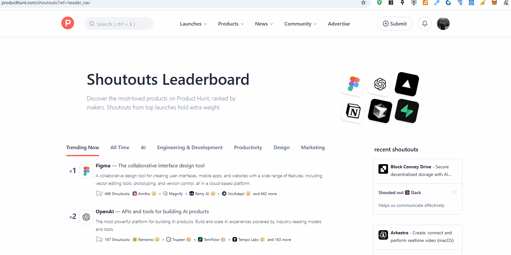

# Ask AnyWhere

# Empower Your Selected Text with Instant Actions

Ask AnyWhere (AAW) transforms how you interact with text on the web. Seamlessly enhance your productivity with this powerful Chrome extension that unlocks a suite of actions based on the text you select on any website.

## Key Features:
- **Instant Action Popup**: Highlight text and get an intuitive popup with a list of actionable options, eliminating the need for additional steps.
- **Ask GPT**: Effortlessly inquire and receive intelligent responses to your queries using advanced AI.
- **Google Search**: Quickly search selected text on Google with a single click.
- **Translation Made Easy**: Instantly translate highlighted text to your desired language.
- **Custom URL Actions**: Add personalized actions to query or search supported websites using the selected text as input.

## Why Ask AnyWhere (AAW)?
- **Save Time**: Streamline workflows by reducing manual copy-pasting and navigation.
- **Customizable**: Tailor the action list to fit your needs and preferred tools.
- **Universal Usability**: Works seamlessly on any website, ensuring maximum convenience.

## How It Works:
1. Highlight any text on a webpage.
2. An action popup appears with options tailored to your needs.
3. Choose an action and watch AAW do the rest—redirecting you, querying AI, or performing a custom task.

Enhance your browsing experience with Ask AnyWhere (AAW). **Download now** and take control of your web interactions like never before!

## Easy perform any action in your browser

## Donation

    ETH: 0xE32b8A3f023061668f29ED81a9DDD07b349f468D
    DOGE: DSot2ptkB4dvJ8xzUPuHTTHJJXyXnkCTmd

